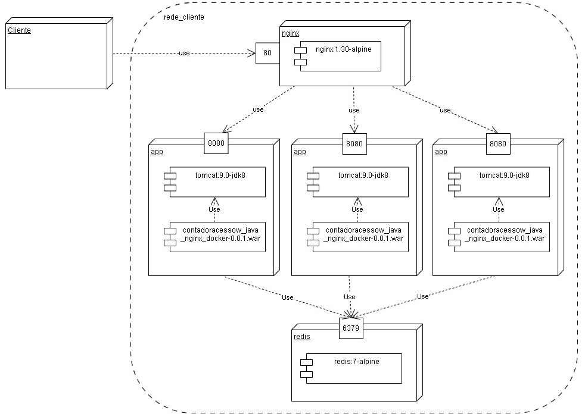

# Contador de acesso em Java WEB com Docker Compose e Redis e Nginx

Aplicação **Contador de Acesso WEB**, desenvolvida em **Java** e executada em um ambiente clusterizado com múltiplas instâncias da aplicação em containers **Docker**, utilizando o **Nginx** como balanceador de carga.

## Sobre o projeto

- O projeto foi desenvolvido utilizando o **NetBeans**.
- O nome do projeto deve ser **contadoracessow_java_nginx_docker**.
- Utiliza o **Java 8**.
- Utiliza o **Apache Tomcat 9** como servidor de aplicações Web.
- Utiliza o **Apache Maven** para automatizar o processo de construção da aplicação.
- A aplicação é empacotada no formato **WAR (Web Application Archive)**.
- Utiliza o **Docker** para criar e executar os containers da aplicação e do banco de dados em memória.
- Utiliza o **Docker Compose** para definir e gerenciar os serviços da aplicação. 
- Utiliza o **Redis 7** como banco de dados em memória da aplicação. 
- Utiliza o **Nginx 1.3 ** como balanceador de carga da aplicação. 

## Docker
 - Utilizer o terminal do Powershel em modo administrador.

### Para criar os conteiners e os serviços
 - ```docker compose up -d --build --scale app=3```

### Parar os serviços
 - ```docker compose down -v```

### Abra o navegador em:
 - http://localhost:80/

### Remover as imagens
 - ```docker compose down --rmi all```

## Arquitetura do Sistema



## Docker Hub
 - https://hub.docker.com/r/osmarbraz/contadoracessow_java_nginx_docker


